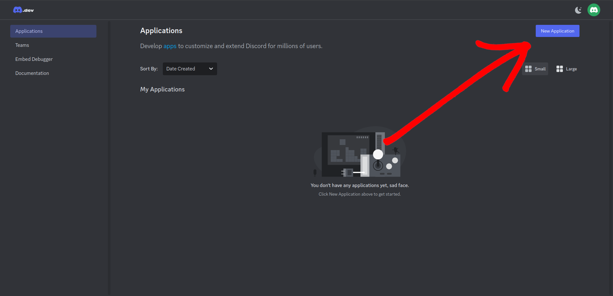
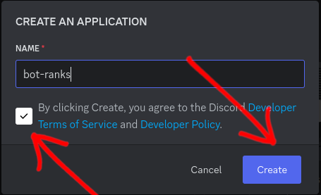
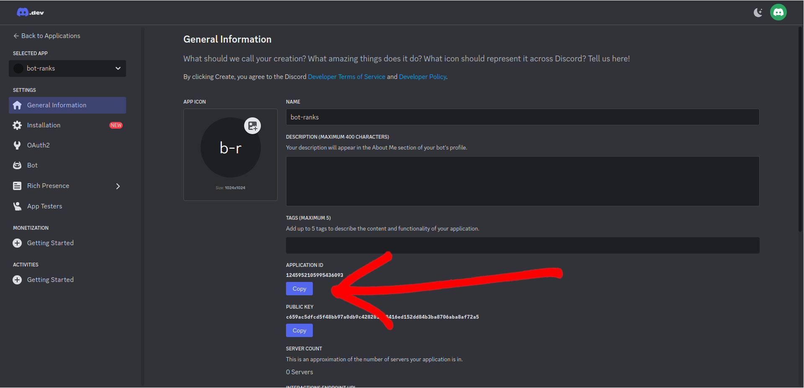
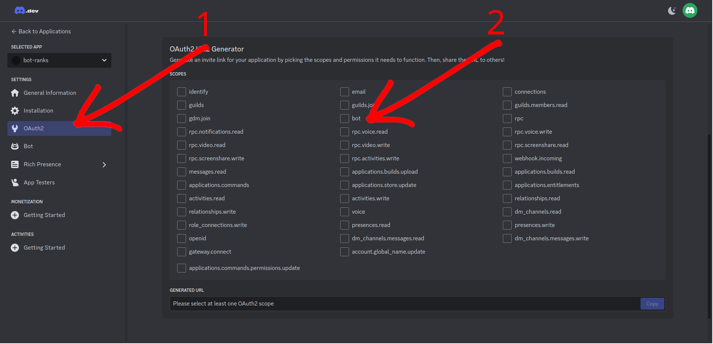
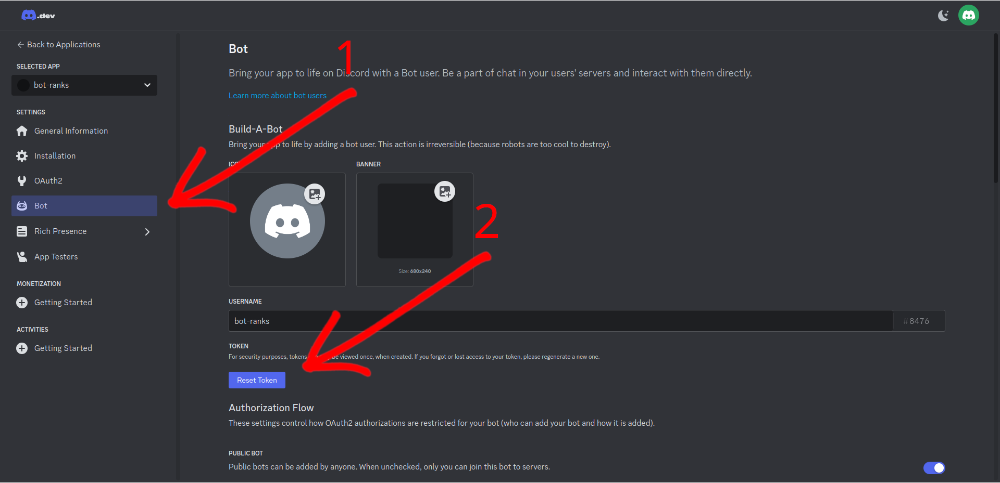
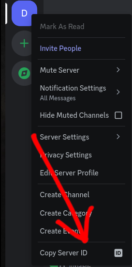

# Bot-Ranks


---

1. [Setup](#setup)
   1. [Bot](#bot)
   2. [Environment](#environment)
   3. [Prisma](#prisma)
2. [Contributors](#contributors)

---

## Setup

### Bot

We're create a bot in a Discord dashboard.

1. Go to [discord.com/developers](https://discord.com/developers) and sign in with your account. (After, automatically redirect to [applications](https://discord.com/developers/applications) section)

2. Create a **New Application**.
   

3. Write a bot name, acept terms and click on **Create**.
   

4. Copy the `APPLICATION ID` and save it for later.
   

5. If you're a _lazy person_, you can copy the link below and replace `YOUR_APPLICATION_ID` with your `APPLICATION ID` save above.<br>
   If you're a _good programmer_ and you learn and don't just copy paste, you can follow the steps below:

   1. Click on **OAuth2** section and select `bot`.
      
   2. Select the permissions that watch the image below and copy the link.
      
   3. Paste the link in your browser and select the server where you want to add the bot.

   For lazy people:

   ```bash
   https://discord.com/oauth2/authorize?client_id=YOUR_APPLICATION_ID&permissions=1978101132400&scope=bot
   ```

6. Go to **Bot** section and click on **Reset Token**, copy the token and save it for later.

   > ⚠️ Be careful with publish the token in internet.

   

7. Go to server that you added the bot in Step 5.<br>
   In the left side bar you right click en your server and copy `Server ID` and save it for later. (If you don't see the _Copy Server ID_ button, go to _User Settings_ -> _Advanced_ -> _Developer Mode_ and enable it, or read [this article](https://support.discord.com/hc/en-us/articles/206346498-Where-can-I-find-my-User-Server-Message-ID-))

   

### Environment

1. Copy the `.env.example` file and rename it to `.env`. Remplace the values with the values saved in the [previous steps](#bot).

   ```bash
   cp .env.example .env
   ```

2. Use the Node.js version specified in the `.nvmrc` file. (Install it if you don't have it installed yet.)

   ```bash
   nvm use
   ```

3. Install the dependencies.

   ```bash
   pnpm install
   ```

4. Run the bot.

   ```bash
    pnpm dev
   ```

### Prisma

#### Generate Prisma Migration

Create initial database schema in database

```bash
pnpm prisma migrate dev --name init
```

#### Database viewer

You can run this command in separate terminal

```bash
pnpm studio
```

# Contributors

<a href="https://github.com/lacrypta/bot-ranks/graphs/contributors">
  
</a>
